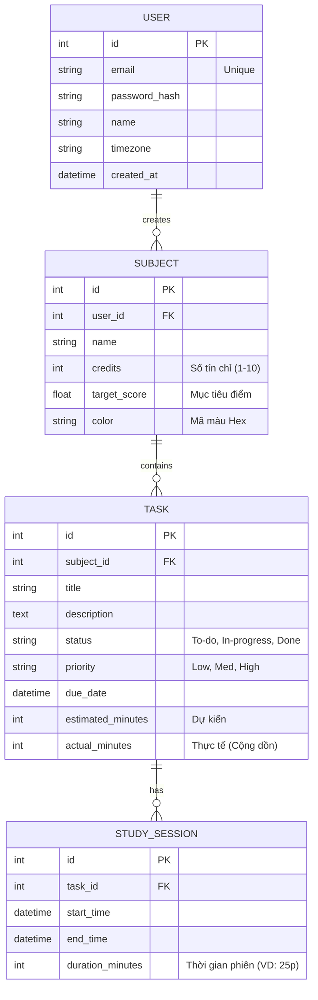

# Project Proposal

## THÔNG TIN

### Nhóm

- Thành viên 1: Võ Đại Phát - 23672291  
- Thành viên 2: Trần Anh Kiệt - 23655711  
- Thành viên 3: Trần Nguyễn Toàn Phát - 23643121  
- Thành viên 4: Phạm Ngọc Toàn - 23672111

### Git

Git repository: https://github.com/dphatIT1911/Smart-Study-Planner-Management-web

# MÔ TẢ DỰ ÁN: NỀN TẢNG TRỢ LÝ HỌC TẬP THÔNG MINH (SMART STUDY PLANNER)

## 1. Ý TƯỞNG DỰ ÁN (THE VISION)

**Tổng quan nền tảng**  
Trong thời đại công nghệ số hóa mọi mặt của đời sống, nhóm chúng tôi quyết định xây dựng **Smart Study Planner** – một nền tảng Web App chuyên biệt dành cho học sinh, sinh viên. Đây không chỉ là một ứng dụng tạo danh sách công việc thông thường, mà được định vị là một "Trợ lý học tập cá nhân hóa". Hệ thống hướng tới việc số hóa toàn diện quá trình học tập: từ quản lý thời khóa biểu, theo dõi deadline, đến việc tự động phân bổ thời gian tự học một cách khoa học nhất.

**Tại sao chúng tôi chọn dự án này? (Giải quyết "Nỗi đau" - Pain Points của người dùng)**  
Qua phân tích nghiệp vụ thực tế, tệp người dùng sinh viên đang phải đối mặt với 3 vấn đề cốt lõi làm giảm sút hiệu suất học tập:  
- **Hội chứng "Nước đến chân mới nhảy":** Sinh viên thường nhận đề tài từ sớm nhưng có xu hướng trì hoãn đến sát hạn chót mới thực hiện, dẫn đến áp lực tâm lý nặng nề và kết quả không tối ưu.  
- **Sự quá tải nhận thức:** Cùng lúc phải ghi nhớ hạn chót của nhiều môn học, lịch họp nhóm, lịch thi và các hoạt động ngoại khóa khiến họ rơi vào trạng thái quá tải và dễ bỏ sót công việc quan trọng.  
- **Thiếu kỹ năng lập kế hoạch:** Đa số sinh viên có mong muốn học tốt nhưng lại thiếu phương pháp để "chẻ nhỏ" một mục tiêu học tập lớn thành các hành động cụ thể cho từng ngày.

**Lợi thế cạnh tranh độc quyền**  
Thị trường hiện có nhiều công cụ quản lý, nhưng Smart Study Planner khai thác một ngách hoàn toàn khác biệt bằng cách khắc phục điểm yếu của các nền tảng hiện tại:  
- **Vượt trội hơn Google/Apple Calendar:** Các ứng dụng này chỉ hiển thị ngày tháng tĩnh, không thấu hiểu được một "Deadline bài luận 5000 từ" đòi hỏi bao nhiêu công sức và cần bắt đầu từ đâu.  
- **Tối ưu hơn Notion:** Thay vì bắt người dùng tự thiết lập các bảng biểu phức tạp và mất thời gian, hệ thống của chúng tôi cung cấp luồng công việc có sẵn, sẵn sàng sử dụng ngay.  
- **Chuyên sâu hơn Todoist/TickTick:** Không dừng lại ở các checklist khô khan, hệ thống được đặt hoàn toàn trong bối cảnh học thuật.

**3 Trụ cột khác biệt của Smart Study Planner:**  
- **Academic-Centric:** Cấu trúc dữ liệu được thiết kế riêng biệt cho môi trường giáo dục (học kỳ, môn học, số tín chỉ, đề cương).  
- **Auto-Breakdown:** Thuật toán thông minh tự động gợi ý lộ trình chia nhỏ một "Big Task" thành các "Micro-Tasks" bám sát trục thời gian.  
- **Energy & Time Blocking:** Tích hợp phương pháp Pomodoro ngay trên nền tảng, giúp người dùng thực sự "Bắt tay vào làm" chứ không chỉ dừng lại ở bước "Lên kế hoạch".

---

## 2. CHI TIẾT NGHIỆP VỤ (BUSINESS LOGIC)

Để hiện thực hóa ý tưởng trên, hệ thống được cấu trúc thành 4 Module nghiệp vụ cốt lõi, giải quyết trọn vẹn vòng đời của quá trình học tập:

### Module 1: Quản trị Học vụ  
- **Nghiệp vụ:** Khởi tạo dữ liệu nền tảng. Để quản lý thời gian hiệu quả, hệ thống cần đánh giá được khối lượng và trọng số kiến thức người dùng đang đối mặt.  
- **Chi tiết:** Vào đầu mỗi học kỳ, sinh viên sẽ thiết lập Thời khóa biểu cố định và Danh sách môn học. Mỗi môn học được gắn kèm các thuộc tính định lượng: Số tín chỉ (phản ánh độ nặng của môn), Mục tiêu điểm số, và Đề cương môn học.  
- **Giá trị mang lại:** Phác họa bức tranh toàn cảnh về khối lượng học tập của cả học kỳ, từ đó làm cơ sở để thuật toán phân bổ mức độ ưu tiên tự động cho từng môn.

### Module 2: Lập kế hoạch Thông minh – Trái tim của hệ thống  
- **Nghiệp vụ:** Chuyển hóa mục tiêu lớn thành chuỗi hành động thực thi hàng ngày.  
- **Chi tiết:** Khi người dùng nhập một sự kiện lớn (Ví dụ: *"Nộp tiểu luận Tâm lý học ngày 30/11"*), hệ thống không chỉ báo thức vào ngày 29/11. Thay vào đó, áp dụng phương pháp Lập kế hoạch lùi, hệ thống sẽ đề xuất một lộ trình:  
  - *Ngày 15/11:* Chốt chủ đề & tìm tài liệu.  
  - *Ngày 20/11:* Lập dàn ý.  
  - *Ngày 25/11:* Viết nháp lần 1.  
  - *Ngày 28/11:* Chỉnh sửa hoàn thiện.  
- Đồng thời, tính năng **Time Blocking** sẽ tự động quét các khoảng thời gian trống trong thời khóa biểu cố định để "đặt lịch" cho các Micro-Tasks này. Sinh viên có thể tùy chỉnh bằng thao tác kéo thả linh hoạt.

### Module 3: Focus Space  
- **Nghiệp vụ:** Giải quyết bài toán thực thi. Kế hoạch hoàn hảo sẽ vô nghĩa nếu thiếu sự tập trung.  
- **Chi tiết:** Đến giờ học đã lên lịch, người dùng kích hoạt "Focus Space". Giao diện sẽ chuyển sang chế độ tập trung với bộ đếm giờ Pomodoro (25 phút học / 5 phút nghỉ) hoặc Flowtime. Hệ thống sẽ ghi nhận "Thời gian học thực tế" và đồng bộ trực tiếp vào tiến độ của môn học đó.  
- **Giá trị mang lại:** Xóa bỏ ranh giới giữa việc "nghĩ là mình đang học" và "thực sự học". Giúp sinh viên trả lời được câu hỏi: *"Khoản thời gian mình đầu tư đã đủ để đạt điểm A như mục tiêu chưa?"*.

### Module 4: Thống kê & Trò chơi hóa (Gamification)  
- **Nghiệp vụ:** Trực quan hóa tiến độ, cảnh báo rủi ro kịp thời và duy trì động lực dài hạn.  
- **Chi tiết:**  
  - **Analytics:** Cung cấp Dashboard theo tuần/tháng với biểu đồ phân bổ thời gian trực quan. Tích hợp hệ thống "Cảnh báo đỏ" cho các môn học đang chậm tiến độ hoặc được đầu tư quá ít thời gian so với số tín chỉ.  
  - **Gamification:** Ứng dụng tâm lý học hành vi để tạo động lực. Khi hoàn thành công việc đúng hạn, người dùng nhận được điểm Kinh nghiệm (EXP), duy trì Chuỗi ngày học tập (Streaks) hoặc nuôi lớn một "Cây tri thức" ảo.  
- **Giá trị mang lại:** Tạo ra các "phần thưởng ngắn hạn" để bù đắp cho đặc thù của việc học vốn đòi hỏi sự nỗ lực dài hạn, giúp sinh viên không bị nản chí.

## PHÂN TÍCH & THIẾT KẾ

> **Ghi chú:** Nhóm sử dụng phương pháp MoSCoW để phân định rõ phạm vi dự án, đảm bảo tính khả thi trong thời gian làm đồ án nhưng vẫn bám sát ý tưởng cốt lõi (Smart Features).

### 1. Yêu cầu chức năng hệ thống

#### Nhóm MUST-HAVE (Bắt buộc phải có - Scope cho MVP):  
Đây là các chức năng cốt lõi để hình thành nên bộ khung của Smart Study Planner.

- **Quản lý Tài khoản:**  
  - **Đăng ký/Đăng nhập:** Người dùng đăng ký bằng email và mật khẩu để đăng nhập vào ứng dụng.  
  - **Ràng buộc:** Email chuẩn format `^[A-Za-z0-9._%+-]+@[A-Za-z0-9.-]+\.[A-Za-z]{2,}$`. Mật khẩu tối thiểu 8 ký tự (gồm chữ hoa, chữ thường, chữ số).  
  - **Quản lý hồ sơ:** Cập nhật tên (3-100 ký tự), avatar, múi giờ.

- **Module Quản lý Học vụ:**  
  - **Tạo/Sửa/Xóa Môn học:** Bắt buộc khởi tạo môn học trước khi quản lý công việc.  
  - **Ràng buộc:** Mỗi môn học cần có Tên môn, Số tín chỉ (1-10), Mục tiêu điểm số, và Màu sắc nhận diện.

- **Module Quản lý Công việc:**  
  - **CRUD Task:** Tạo, xem chi tiết, sửa, xóa công việc.  
  - **Ràng buộc dữ liệu:** Tiêu đề (3-100 ký tự), Mô tả (<5000 ký tự).  
  - **Liên kết:** Mỗi Task bắt buộc phải thuộc về 1 Môn học (hoặc mục General).  
  - **Thuộc tính:** Due date (Thời hạn lấy theo múi giờ), Priority (Low/Med/High), Estimated Time (Thời gian dự kiến - tính bằng phút).  
  - **Trạng thái:** To-do, In-progress, Done, Overdue.

- **Module Lịch học:**  
  - Hiển thị tất cả Task lên lưới lịch theo định dạng Ngày/Tuần/Tháng.  
  - Hỗ trợ xem chi tiết và chuyển đổi trạng thái task nhanh trên lịch.

- **Module Focus Space - Pomodoro:**  
  - Tích hợp đồng hồ bấm giờ đếm ngược 25 phút học / 5 phút nghỉ.  
  - **Log time:** Khi hoàn thành 1 phiên, hệ thống tự động ghi nhận "Thời gian học thực tế"  
vào Task tương ứng.

#### Nhóm SHOULD-HAVE:  
- **Dashboard Thống kê:** Trực quan hóa dữ liệu học tập. Cung cấp biểu đồ so sánh giữa *Thời gian dự kiến* và *Thời gian thực tế* đã dành cho từng môn học.  
- **Hệ thống Nhắc nhở:** Gửi thông báo (In-app hoặc Email) trước khi tới Due date 1 ngày và 1 giờ.

#### Nhóm COULD-HAVE:  
- **Auto-Breakdown:** Tính năng tự động chia 1 Task lớn (VD: Ôn thi cuối kỳ) thành các Task nhỏ bám sát trục thời gian bằng các rule cơ bản.  
- **Gamification:** Hệ thống tính điểm Kinh nghiệm (EXP) và hiển thị Chuỗi ngày học tập (Streak) để duy trì động lực.

---

### 2. Yêu cầu Phi chức năng

- **Giao diện & Trải nghiệm (UI/UX):**  
  - Thiết kế Responsive, tối ưu hiển thị trên cả Desktop và Tablet/Mobile.  
  - Thao tác chuyển đổi trạng thái task phản hồi nhanh chóng (dưới 0.5 giây).  
- **Bảo mật:**  
  - Mật khẩu phải được hash bằng `bcrypt` trước khi lưu vào Database.  
  - Các route API (ngoại trừ Login/Register) phải được bảo mật bằng JWT Token.  
- **Hiệu năng & Khả năng mở rộng:**  
  - Áp dụng phân trang cho các danh sách Task để tối ưu thời gian tải.  
- **Tính bảo trì:**  
  - Source code tuân thủ Clean Code, có comment rõ ràng.  
  - Có file `README.md` cung cấp hướng dẫn cài đặt và chạy local chi tiết.

---

### 3. Mô hình Thực thể Dữ liệu (Entity Relationship - Lược đồ mức logic)

Hệ thống dự kiến được thiết kế xoay quanh 4 thực thể (Entities) cốt lõi:  
1. **USER:** `id`, `email`, `password_hash`, `name`, `timezone`.  
2. **SUBJECT:** `id`, `user_id`, `name`, `credits`, `target_score`, `color`.  
3. **TASK:** `id`, `subject_id`, `title`, `description`, `status`, `priority`, `due_date`, `estimated_minutes`, `actual_minutes`.  
4. **STUDY_SESSION:** `id`, `task_id`, `start_time`, `end_time`, `duration_minutes`. *(Phục vụ Tracking dữ liệu cho Dashboard)*.


---

### 4. Kiến trúc hệ thống  
```mermaid  
graph TD  
    classDef client fill:#dbeafe,stroke:#3b82f6,stroke-width:2px,color:#1e3a8a;  
    classDef backend fill:#dcfce7,stroke:#22c55e,stroke-width:2px,color:#14532d;  
    classDef database fill:#fef08a,stroke:#eab308,stroke-width:2px,color:#713f12;  
    classDef external fill:#f3f4f6,stroke:#9ca3af,stroke-width:2px,color:#374151,stroke-dasharray: 5 5;  
    subgraph Client_Tier ["Tầng giao diện"]  
        A["Web browser"]:::client --> B("Ứng dụng ReactJS<br/>Quản lý Giao diện & Trạng thái"):::client  
    end  
    subgraph Application_Tier ["Backend API"]  
        B --> |API| C("API Gateway / Router<br/>FastAPI"):::backend  
          
        C --> D["Middleware<br/>Xác thực JWT & BCrypt"]:::backend  
        C --> E["Core Controller<br/>Xử lý Logic: Môn học, Task, Pomodoro"]:::backend  
        C --> F["Analytics Engine<br/>Tính toán Thống kê tiến độ"]:::backend  
    end  
    subgraph Data_Tier ["Database"]  
        E --> |Truy vấn & Lưu trữ| G["Cơ sở dữ liệu<br/>PostgreSQL"]:::database  
        F --> G  
    end  
    subgraph External_Services ["Dịch vụ mở rộng"]  
        E -. "Lên lịch gửi thông báo" .-> H["Email Service<br/>SendGrid / Nodemailer"]:::external  
    end  
```  
---

### 5. Use case diagram  


---

### 6. Công nghệ sử dụng (Tech Stack)

- **Frontend:** ReactJS, Tailwind, PrimeReact, PrimeIcon  
- **Backend:** Python (FastAPI)  
- **Database:** PostgreSQL (SQL)   
- **Deployment:** Vercel (Frontend) & Render/Railway (Backend)

## KẾ HOẠCH

### MVP

**1. Mô tả các chức năng MVP (Thời hạn hoàn thành: 12.04.2026)**  
Ở giai đoạn MVP, hệ thống sẽ hoàn thiện toàn bộ luồng nghiệp vụ cốt lõi (Nhóm MUST-HAVE) để đảm bảo một vòng đời sử dụng hoàn chỉnh của người dùng:  
- **Xác thực người dùng:** Đăng nhập, đăng ký tài khoản với các ràng buộc bảo mật cơ bản (Validate Email, Hash Password).  
- **Thiết lập Học vụ:** Cho phép người dùng tạo và quản lý danh sách Môn học (Tên, số tín chỉ, mục tiêu).   
- **Quản lý Task:** Thực hiện đầy đủ các thao tác CRUD (Tạo, Đọc, Sửa, Xóa) công việc. Ràng buộc thành công việc gán Task vào Môn học và thời hạn (Due date) hợp lý.  
- **Focus Space:** Đồng hồ đếm ngược Pomodoro (25p/5p) hoạt động ổn định trên trình duyệt và ghi nhận được thời gian học thực tế lưu xuống Database.  
- **Giao diện Lịch:** Render thành công danh sách Task lên lưới lịch trực quan.

**2. Kế hoạch kiểm thử**  
Quá trình kiểm thử sẽ tập trung vào tính toàn vẹn dữ liệu và luồng trải nghiệm. Dưới đây là các Test Case (TC) trọng tâm phục vụ **Manual Testing**:

| Mã TC | Chức năng | Hành động | Kết quả mong đợi |  
| :--- | :--- | :--- | :--- |  
| **TC-01** | Xác thực | Nhập email sai định dạng (vd: `student@.com`) hoặc mật khẩu dưới 8 ký tự. | Hệ thống chặn form, hiển thị thông báo lỗi cụ thể ngay tại field tương ứng. |  
| **TC-02** | Task CRUD | Tạo Task mới nhưng chọn `Due Date` là một ngày trong quá khứ. | Hệ thống từ chối lưu, cảnh báo "Thời hạn không hợp lệ". |  
| **TC-03** | Task Link | Tạo Task nhưng không chọn thuộc về Môn học nào. | Cảnh báo yêu cầu chọn môn học hoặc tự động gán vào mục "General". |  
| **TC-04** | Pomodoro | Chạy bộ đếm 25 phút đến khi kết thúc (00:00). | Nút "Hoàn thành phiên" hiện ra. Sau khi xác nhận, thời gian thực tế (`actual_minutes`) của Task được cộng thêm 25. |  
| **TC-05** | Lịch học | Đổi trạng thái Task từ "To-do" sang "Done" trên bảng chi tiết. | Lịch học lập tức cập nhật màu sắc/trạng thái của Task đó mà không cần F5 (Reload) trang. |  
- **Unit Testing:**  
  - Viết các Unit Test (sử dụng PyTest) cho các API Endpoints và Logic nghiệp vụ cốt lõi.  
  - *Các Test Case tiêu biểu:* Kiểm tra thuật toán băm mật khẩu, validate định dạng email/password, test logic cộng dồn thời gian (actual_minutes) của Pomodoro, và kiểm tra các ràng buộc cơ sở dữ liệu (VD: Không thể xóa môn học nếu vẫn còn task đang active).

**3. Những chức năng dự trù thực hiện ở Phase kế tiếp**  
Sau khi chốt xong MVP, nhóm sẽ tiến hành phát triển các tính năng nâng cao để tối ưu điểm số đồ án:  
- **Analytics Dashboard:** Xây dựng biểu đồ thống kê thời gian thực tế so với dự kiến.  
- **Hệ thống Nhắc nhở:** Gửi thông báo cảnh báo deadline sắp tới.  
- **Hoàn thiện UI/UX:** Tối ưu hóa giao diện Responsive để sử dụng mượt mà trên thiết bị di động.  
- **Auto-Breakdown (Nếu kịp tiến độ):** Thuật toán rule-based chia nhỏ task tự động.

---

### Beta Version  
**Thời hạn hoàn thành dự kiến:** 10.05.2026

- **Kết quả kiểm thử:**  
  - Báo cáo tổng hợp độ phủ (Code Coverage) của Unit Test Backend (mục tiêu đạt >70% cho các controller chính).  
  - Bảng danh sách các lỗi phát hiện trong quá trình Manual Test UI ở phase MVP và tình trạng đã khắc phục.  
- **Viết báo cáo:**  
  - Hoàn thiện tài liệu Hướng dẫn sử dụng.  
  - Viết báo cáo tổng kết Đồ án cuối kỳ, phân tích những điểm làm được, chưa làm được và hướng phát triển tương lai.

## CÂU HỎI

1. **Về đánh giá tính năng:** Với tính năng "Auto-Breakdown", nếu nhóm sử dụng các thuật toán Rule-based đơn giản thay vì tích hợp AI phức tạp để đảm bảo tiến độ, thì có đáp ứng được tiêu chí chấm điểm của môn học không ạ? 

2. **Về phạm vi kiểm thử:** Nhóm dự định viết Unit Test cho khoảng 70% các API quan trọng nhất ở Backend, kết hợp với Manual Test UI. Mức độ kiểm thử như vậy đã đủ cho yêu cầu của một đồ án cuối kỳ chưa, hay cần bổ sung thêm Integration Test/E2E Test ạ? 

3. **Về cấu trúc CSDL:** Việc tách riêng bảng `STUDY_SESSION` để lưu trữ từng phiên Pomodoro (nhằm phục vụ vẽ biểu đồ thống kê sau này) có bị coi là over-engineering cho đồ án môn học không, hay nên gộp thẳng dữ liệu này vào bảng `TASK` để tối ưu thời gian query ạ?

---

